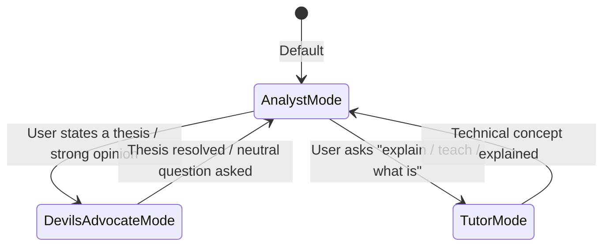

# Document 1: Product Specification

This document details the functional specifications, product capabilities, user experience requirements, and scope boundaries for **btc-chat-agent**.

---

## 👁️ High-Level Vision

The **Bitcoin Chat Agent** is a professional companion for active cryptocurrency traders. Unlike typical chatbots that act as neutral web-search wrappers or dry fact-checkers, this agent is designed to be a **thinking partner with personality**. It adapts its conversational tone to match the user's focus, understands the user's trading positions in real-time, and has exclusive, deep access to a MongoDB database populated by a complex daily analytical pipeline.

---

## 🎭 Dynamic Conversational Modes

The agent dynamically switches its core behavior depending on the conversation context, providing a highly tailored user experience.

### 1. 🔍 Analyst Mode (Default)
* **Trigger:** The default state when starting a chat or asking descriptive, analytical, or market-data questions.
* **Behavior:** Synthesizes pipeline data, reports market consensus, and details recent analysis. It integrates technique accuracy ratios and prediction statuses automatically.
* **Tone:** Professional, objective, data-backed, and concise.

### 2. ⚔️ Devil's Advocate Mode
* **Trigger:** Activated implicitly when the user states a strong market opinion or trade thesis (e.g., *"I think BTC is heading straight to $95k because of the supply crunch"*). It can also be explicitly forced using the `/devil` slash command.
* **Behavior:** Aggressively but constructively argues the counter-thesis using evidence from pipeline data. It is designed to stress-test the user's logic and expose blind spots.
* **Tone:** Skeptical, analytical, contrarian, and challenging.

### 3. 📚 Tutor Mode
* **Trigger:** Activated implicitly when the user asks conceptual or technical educational questions (e.g., *"Explain CVD"*, *"What is Open Interest?"*). It can also be explicitly forced using the `/tutor` slash command.
* **Behavior:** Explains complex trading and technical analysis indicators using actual real-world data and events cataloged in the `technique_ledger` and pipeline databases. Instead of abstract definitions, it uses historical pipeline records to show *how* a technique performed.
* **Tone:** Instructive, patient, clear, and illustrative.

---

## 💎 Core Features (Must-Have)

### 📊 1. Position Context
* The agent has a core awareness of the user's skin in the game.
* The user can state their trade position (e.g., *"I am long from $67,500"*), which persists across sessions in the `user_position` collection.
* **Behavioral Integration:** Every subsequent response frames the market analysis relative to this position. It reports entry-to-current distance, P&L calculations, and notes if market changes threaten the user's trade thesis.

### 🧠 2. Pipeline Memory Access
* The agent possesses read-only access to five pipeline collections in MongoDB:
  1. `agent_memory`: The pipeline's compressed daily market state and consensus.
  2. `daily_analyses`: Deep records of analyzed videos, channel sentiments, and key levels.
  3. `technique_ledger`: Accuracy tracking and description of specific technical indicators.
  4. `predictions`: Resolved and open predictions with outcomes.
* The agent queries these collections to retrieve high-context answers rather than relying on stale generic LLM weights.

### 💬 3. Conversation & Session Memory
* **Within Session:** Standard full conversational history is preserved so the user can build on previous thoughts.
* **Across Sessions:** Standard user session info and positions are saved in the `chat_sessions` collection, allowing future analysis and review.

### 💰 4. On-Demand Market Price
* The agent can fetch current BTC/USDT price data and recent candlestick logs (OHLCV) on demand by calling the Binance REST API.
* **Usage:** Prevents the agent from talking about historical data as if it were the absolute present, allowing direct real-time comparisons with the user's entry prices.

---

## 📈 Nice-to-Have Features (Future Iterations)

These features represent highly valuable, planned expansions that will be developed in successive phases after the core features are validated:

* **📋 Pre-Trade Checklist:** Before a user enters a trade, the agent walks them through a structured checklist: entry thesis, invalidation levels, profit targets, and position sizing. These checklists are saved to MongoDB for future review.
* **📉 Consensus Drift View:** Allows the user to ask, *"How has market sentiment shifted over the last two weeks?"* The agent compares daily sentiments and market structures from the database to map drift trends.
* **🔁 Prediction Post-Mortem:** Allows users to query why past predictions by specific channels succeeded or failed by looking back at the exact market context when they were declared.
* **🖼️ Chart Screenshot Analysis:** The user can upload a TradingView chart screenshot, and the agent uses Gemini's Vision models to identify patterns and identify indicators visible in the chart.

---

## 🌪️ Wild Ideas (Optional / Under Consideration)

* **🧘 Emotional State Tracker:** Allows the user to tag their emotional state at the start of a session (e.g., `"FOMO"`, `"Anxious"`, `"Overconfident"`). After 30 days, the user can ask: *"Do I make better entry decisions when feeling FOMO or when anxious?"*
* **🎯 Proactive Invalidation Tracker:** If the user sets an invalidation price level (e.g., *"Exit if daily closes under $74,000"*), the agent monitors price action on-demand and highlights when the spot price is drawing dangerously close to the invalidation boundary.

---

## ⛔ Explicitly Out of Scope

To maintain project focus, simplicity, and safety, the following items are strictly out of scope:
1. **Trade Execution:** The agent will **never** have write access to exchange APIs, private keys, or wallet functions. It cannot execute, modify, or close trades.
2. **Multi-Asset Portfolio Tracking:** The app supports **Bitcoin (BTC) only**. It does not track altcoins, stock portfolios, or general multi-asset histories.
3. **Live WebSockets:** No open connections for tickers. Price queries are purely REST-based and fetched on demand to keep resource footprint low.
4. **Data Ingestion via Chat:** The agent is read-only regarding pipeline data. It cannot add new channels, edit processed logs, or trigger pipeline runs from the chat window.
5. **Multi-User / Multi-Tenant Support:** The application is built for a single user (the owner). No user creation tables, registration forms, or multi-tenant database partitioning.

---

## ⚙️ Key Product Design Decisions

1. **Implicit Mode Transitions:** The agent automatically scans user messages to decide if a mode change is appropriate (e.g. arguing against stated beliefs, teaching technical setups).
2. **Explicit Slash Command Overrides:**
   * `/analyst` : Forces the agent back into objective analysis mode.
   * `/devil` : Mandates the agent to challenge the user's opinions or current trade plans.
   * `/tutor` : Instructs the agent to break down technical definitions with pipeline data.
3. **Conversational Model Strategy:** The LLM architecture is built to support hot-swapping providers. While Google Gemini 2.5 Flash is the default, the backend interface makes it effortless to toggle to Claude or Anthropic models for more advanced conversational debate dynamics.
