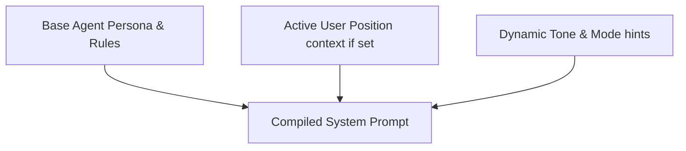

# Document 2: Technical Architecture

This document maps out the backend and frontend engineering patterns, code-level abstractions, and key infrastructure components of the **btc-chat-agent** application.

---

## ⚡ Key Abstractions & Technologies

1. **Framework:** Next.js 14 (App Router) + TypeScript.
2. **AI Integration:** Vercel AI SDK (Core and React packages) supporting stream rendering.
3. **Database:** MongoDB Atlas (shared with the Python pipeline).
4. **API Integration:** Binance REST API (Public REST client).
5. **Security:** Simple HTTP-only cookie password gating via Next.js Edge Middleware.

---

## 🧠 The Swappable LLM Provider Pattern

To avoid being coupled to a single model provider, the LLM layer is decoupled using an interface. The rest of the app imports `getLLMProvider()`, which dynamically resolves the configured model at runtime.

### 1. The Interface (`src/lib/llm/interface.ts`)
```typescript
import type { LanguageModel } from 'ai'

export interface LLMProvider {
  model: LanguageModel
  modelId: string
}
```

### 2. Gemini Implementation (`src/lib/llm/gemini.ts`)
```typescript
import { createGoogleGenerativeAI } from '@ai-sdk/google'
import type { LLMProvider } from './interface'

const google = createGoogleGenerativeAI({
  apiKey: process.env.GOOGLE_API_KEY!,
})

const provider: LLMProvider = {
  model: google(process.env.LLM_MODEL ?? 'gemini-2.5-flash'),
  modelId: process.env.LLM_MODEL ?? 'gemini-2.5-flash',
}

export default provider
```

### 3. Resolver Factory (`src/lib/llm/index.ts`)
```typescript
import type { LLMProvider } from './interface'

export async function getLLMProvider(): Promise<LLMProvider> {
  const providerName = process.env.LLM_PROVIDER ?? 'gemini'
  
  if (providerName === 'gemini') {
    const mod = await import('./gemini')
    return mod.default
  }
  
  // Future expansion: Anthropic / Claude
  if (providerName === 'anthropic') {
    const mod = await import('./anthropic')
    return mod.default
  }
  
  throw new Error(`Unsupported LLM_PROVIDER: ${providerName}`)
}
```

---

## 🔌 Database Layer: Singleton Connection Pattern

To prevent connection exhaustion in serverless environments, the application implements a global cache singleton for the MongoDB client.

```typescript
// src/lib/db/client.ts
import { MongoClient } from 'mongodb'

if (!process.env.MONGODB_URI) {
  throw new Error('Invalid/Missing environment variable: "MONGODB_URI"')
}

const uri = process.env.MONGODB_URI
const options = {}

let client: MongoClient
let clientPromise: Promise<MongoClient>

if (process.env.NODE_ENV === 'development') {
  // Use a global variable to preserve connection across HMR (Hot Module Replacement)
  let globalWithMongo = global as typeof globalThis & {
    _mongoClientPromise?: Promise<MongoClient>
  }

  if (!globalWithMongo._mongoClientPromise) {
    client = new MongoClient(uri, options)
    globalWithMongo._mongoClientPromise = client.connect()
  }
  clientPromise = globalWithMongo._mongoClientPromise
} else {
  // In production, we don't use global variables
  client = new MongoClient(uri, options)
  clientPromise = client.connect()
}

export default clientPromise
```

---

## 🛠️ Tool Calling Pattern (Vercel AI SDK)

All assistant tools are configured using the Vercel AI SDK `tool()` helper. This guarantees that tools are defined in a type-safe manner and can be passed directly to the LLM streaming endpoint.

```typescript
// Example of Tool Pattern: src/lib/tools/price.ts
import { tool } from 'ai'
import { z } from 'zod'

export const getCurrentPrice = tool({
  description: 'Fetches the real-time spot price of BTC/USDT from Binance REST endpoint.',
  parameters: z.object({}),
  execute: async () => {
    try {
      const response = await fetch('https://api.binance.com/api/v3/ticker/price?symbol=BTCUSDT')
      if (!response.ok) throw new Error('Binance API response failed')
      const data = await response.json()
      return {
        price: parseFloat(data.price),
        symbol: 'BTCUSDT',
        timestamp: new Date().toISOString(),
      }
    } catch (error) {
      return { error: 'Could not fetch current BTC price.' }
    }
  },
})
```

---

## 🏗️ Core API Route Architecture

The endpoint `src/app/api/chat/route.ts` is the single source of truth for conversational orchestration. It extracts messages and user positions, loads the LLM provider, builds the prompt, executes up to 5 steps of tools dynamically, and streams the output directly back to the front-end.

```typescript
// src/app/api/chat/route.ts
import { streamText } from 'ai'
import { getLLMProvider } from '@/lib/llm'
import { allTools } from '@/lib/tools'
import { buildSystemPrompt } from '@/lib/prompts/system'

export async function POST(req: Request) {
  try {
    const { messages, position } = await req.json()
    const { model } = await getLLMProvider()
    const systemPrompt = buildSystemPrompt(position ?? null)

    const result = streamText({
      model,
      system: systemPrompt,
      messages,
      tools: allTools,
      maxSteps: 5, // Allows multi-step tool reasoning chains
    })

    return result.toDataStreamResponse()
  } catch (error: any) {
    return new Response(JSON.stringify({ error: error.message }), {
      status: 500,
      headers: { 'Content-Type': 'application/json' },
    })
  }
}
```

---

## 📋 System Prompt Engine

The prompt is constructed dynamically in `src/lib/prompts/system.ts` for each user query.



1. **Static Persona Rules:** Dictates the agent's background, analytical approach, direct conversational stance, and zero-hedging requirements.
2. **Context-Aware Position Injection:** If the database contains an active user position (e.g., long at $67,500), a custom snippet is appended:
   > *"The user is currently LONG from $67,500. Frame all market indicators relative to their entry. Calculate active P&L when Spot Price is loaded. Highlight distance to key levels."*
3. **Tone Injection Rules:** Outlines instructions for detection rules and slash command forces.

---

## 🔒 Security Gate: Password Auth Guard

Since the application is designed for personal use and connects to private resources, it is protected by a lightweight, edge-based auth wall.

1. **The Middleware (`middleware.ts`):** Interrupts request cycles to verify the existence of a signed password cookie. Unverified web visits are redirected to a simplified password landing page.
2. **Auth API:** Standard route checking `process.env.APP_PASSWORD` and returning a signed HTTP-only cookie.

---

## 🛠️ Environment Variables Configuration

Create a `.env.local` file in the root directory for development:

```bash
# LLM Credentials
GOOGLE_API_KEY=your_gemini_api_key_here

# MongoDB Credentials
MONGODB_URI=mongodb+srv://<username>:<password>@cluster.mongodb.net/btc_pipeline?retryWrites=true&w=majority

# Security Keys
APP_PASSWORD=choose_a_strong_password_for_ui_access

# Swappable Providers Configuration
LLM_PROVIDER=gemini
LLM_MODEL=gemini-2.5-flash
```
