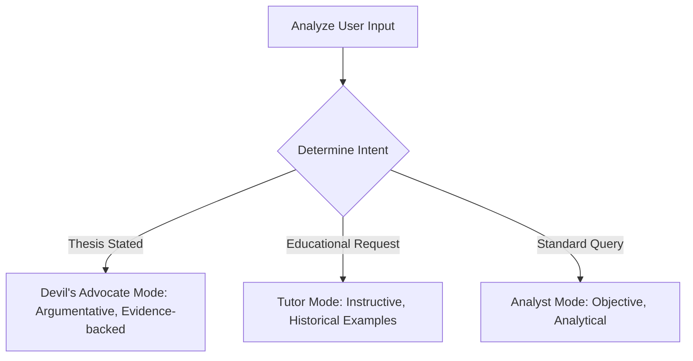

# Document 5: Project Memory & Rules

This document serves as the master playbook, memory cache, and strict rules database for the **btc-chat-agent** project. It guarantees that any future developer or AI agent remains fully aligned with the project's architecture, design language, and functional goals.

---

## 🎯 Core Project Goal

The absolute target is to build **btc-chat-agent** — a highly responsive, premium Bitcoin chat companion that acts as a trader's thinking partner. It combines real-time data fetching, strict security gates, and structured access to a separate daily pipeline database to deliver deep, context-aware trading insights tailored precisely to the user's active trade position.

---

## 🛑 Absolute Engineering Rules (Never Violate)

Every developer and coding agent working on this codebase must adhere strictly to these architectural constraints:

### 1. Next.js App Router Architecture
* **Rule:** Use App Router conventions ONLY.
* All route pages and APIs must exist under `src/app/`.
* NEVER use standard `pages/` directory patterns.
* Do not use legacy data hooks (`getServerSideProps`, `getStaticProps`, `getInitialProps`). Data fetching must be performed using React Server Components or edge API handlers (`route.ts`).

### 2. LLM Execution Boundaries
* **Rule:** LLM provider libraries must run EXCLUSIVELY in Server API Routes.
* Never import `ai`, `@ai-sdk/google`, or other LLM engines inside React components.
* The API endpoint `src/app/api/chat/route.ts` is the single gateway to LLM streaming operations.

### 3. Database Connection Singleton Pattern
* **Rule:** Database connections must utilize the cached global singleton.
* Connection pooling is limited in serverless functions. To prevent connection leaks and exhaustion, you must import `clientPromise` from `src/lib/db/client.ts`.
* NEVER invoke `new MongoClient()` in other code blocks.

### 4. Decoupled Provider Factory
* **Rule:** Always resolve LLM objects using `getLLMProvider()`.
* Never hardcode direct imports to `@ai-sdk/google` or static models in the API routes. 
* All API actions must load the dynamic factory from `src/lib/llm/index.ts` to preserve hot-swappability.

### 5. Type-Safe Tool Declarations
* **Rule:** All agent tools must implement Vercel AI SDK `tool()` helpers.
* Never write raw objects or custom handlers to declare tools.
* Define strict `zod` schemas validating parameters for every tool, exporting them cleanly in `src/lib/tools/`.

### 6. Streaming UI and State Hook
* **Rule:** Force streamed text transmission and utilize React custom hooks.
* The API handler must return Vercel's `.toDataStreamResponse()` derived from `streamText`.
* The frontend must manage message states, API triggers, and tool calls using Vercel AI SDK's custom client-side hook: `useChat`.

### 7. Strict Component Boundaries
* **Rule:** Isolate Client-Side components carefully.
* Default to React Server Components. `src/app/chat/page.tsx` must remain a Server Component that handles initial data loading.
* The `"use client"` declaration is strictly limited to separate sub-components (like `ChatWindow` or input interfaces) that require standard interactive hooks (`useState`, `useEffect`, `useChat`).

### 8. Strict TypeScript Compliance
* **Rule:** Compile-time strict checks are mandatory.
* Set `"strict": true` in `tsconfig.json`.
* NEVER implement the `any` keyword. Define exact structural contracts, shapes, and interfaces in `src/types/index.ts` and import them cleanly.

---

## 🎨 Premium UI & Design Guidelines

The visual quality of this application must feel professional, resembling a premium, high-end trading terminal. Avoid generic designs.

```text
┌────────────────────────────────────────────────────────┐
│               Visual & Aesthetics Grid                 │
├─────────────┬──────────────────────────────────────────┤
│ Attribute   │ Specification                            │
├─────────────┼──────────────────────────────────────────┤
│ Theme       │ Pitch dark background with subtle tints  │
│ Colors      │ Deep charcoal, zinc gray, emerald green  │
│ Effects     │ Glassmorphism, card backdrops, glow      │
│ Font        │ Clean sans-serif (e.g. Inter / Geist)    │
│ Animations  │ Soft fade-ins, elastic loaders           │
└─────────────┴──────────────────────────────────────────┘
```

1. **Elegant Color Palettes:**
   * Primary Dark: Pitch-black background (`bg-black`) blended with dark charcoal (`bg-zinc-950`).
   * UI Accents: Emerald green for long-position statistics (`text-emerald-500`), ruby red for short positions (`text-rose-500`), and subtle violet or amber glows for active tools.
2. **Glassmorphism Backdrop Filters:** Use semi-transparent layers combined with blur properties (`backdrop-blur-md bg-zinc-900/60 border-zinc-800/80`) to design navigation bars, panels, and sidebars.
3. **Dynamic Responsive Layouts:** Design responsive page structures. Provide clean margin structures, scrollable window controls, and fixed bottom text bars that scale correctly across desktop and mobile screens.
4. **Interactive Hover Transitions:** Add transitions to interactive assets (`transition-all duration-200 ease-in-out`). Apply subtle scale increases, color transformations, and border glows to buttons, tabs, and switches on hover.
5. **No Visual Placeholders:**
   * Never render empty layout placeholders. 
   * If assets or profile badges are missing, generate premium, clean SVG components or call the `generate_image` tool to craft beautiful graphic mockups.
6. **Detailed Tool Activity Loader:**
   * When the agent triggers tools in the background (e.g., calling the database or checking prices), show the activity cleanly in the message list using custom loader indicators.
   * Provide custom, user-friendly feedback: `"Querying pipeline database..."`, `"Loading real-time Binance prices..."`, rather than dump raw console syntax to the user.

---

## 🧠 Dynamic Prompt & Tone Directives

The agent must maintain conversational coherence and execute tone shifts automatically:



### 1. Adapting Tone to Stated Opinions
* When the user expresses a thesis (e.g., *"Bitcoin will break past $100k next week"*), the system must immediately shift to **Devil's Advocate Mode**. It should challenge the thesis with historical evidence and contrarian indicators from the database.
* Do not sound hostile or dismissive. Maintain a highly professional, inquisitive, and analytical perspective designed to uncover risks.

### 2. Teaching with Practical Examples
* When a user queries technical definitions (e.g., *"How is CVD calculated?"*), the agent must switch to **Tutor Mode**.
* Avoid reciting dry, textbook definitions. Retrieve actual historical observations and performance ratios from `technique_ledger` and `daily_analyses` to illustrate the concept.

### 3. Preserving Context
* Maintain a deep awareness of the user's position throughout the entire conversation.
* If a position is active, frame every piece of market advice around it. For instance: *"This resistance at $69,200 is located 2.4% above your entry price. Breaking this level could open a path to..."*

### 4. Integrity of Existing Files
* Always protect code blocks that are already working. When modifying files, do not remove unrelated comments, document blocks, or auxiliary methods unless explicitly instructed to do so.
