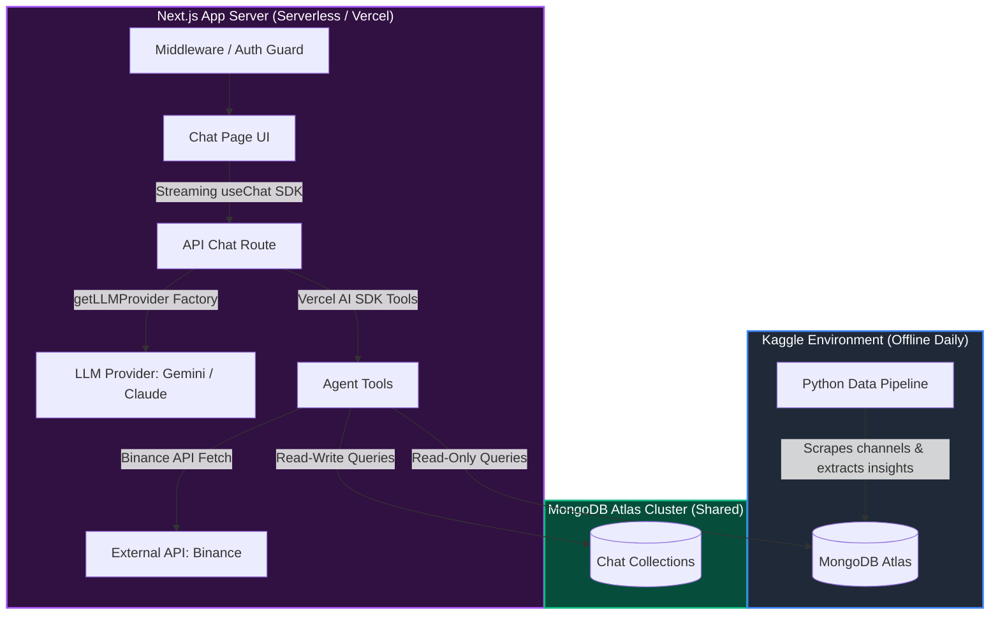

# Bitcoin Chat Agent Documentation Suite

Welcome to the official documentation suite for **btc-chat-agent** — a highly personalized, intelligent Bitcoin analysis assistant. 

This agent functions as a premium, adaptive thinking partner that knows your skin in the game (your current trade positions), consumes live market prices on demand, and integrates with deep historical market analyses populated by a daily-running Python data pipeline on Kaggle.

---

## 🗺️ Documentation Directory

This documentation has been reorganized to eliminate overlaps, resolve inconsistencies, and establish clear guidelines for development.

| Document | Purpose | Key Contents |
| :--- | :--- | :--- |
| [**1. Product Specification**](file:///Users/annasblackhat/Documents/Experiment/btc-chat-agent/.agents/rules/1_product_specification.md) | High-level vision and features | Adaptive modes (Analyst, Devil's Advocate, Tutor), core features, wild ideas, and exclusions. |
| [**2. Technical Architecture**](file:///Users/annasblackhat/Documents/Experiment/btc-chat-agent/.agents/rules/2_technical_architecture.md) | Engineering design & frameworks | Next.js App Router patterns, swappable LLM provider factory, singleton DB client, Vercel AI SDK structure, and security. |
| [**3. Database Schemas**](file:///Users/annasblackhat/Documents/Experiment/btc-chat-agent/.agents/rules/3_database_schemas.md) | MongoDB collections reference | Complete schema breakdown of read-only pipeline collections (`agent_memory`, `daily_analyses`, etc.) and read-write chat collections. |
| [**4. Implementation Roadmap**](file:///Users/annasblackhat/Documents/Experiment/btc-chat-agent/.agents/rules/4_implementation_roadmap.md) | Step-by-step build checklist | A sequential, 10-session build order designed to construct the application incrementally with strict dependency handling. |
| [**5. Project Memory & Rules**](file:///Users/annasblackhat/Documents/Experiment/btc-chat-agent/.agents/rules/5_project_memory_and_rules.md) | Agent memory and coding playbooks | Absolute rules for codebase health, coding conventions, Next.js best practices, and frontend styling requirements. |

---

## 🏗️ High-Level System Architecture

The following Mermaid diagram outlines the data flow and boundary separations between the offline Kaggle data pipeline, the shared MongoDB Atlas cluster, and the Next.js serverless application.



---

## 🗂️ Project Directory Map

This is the canonical file structure for `btc-chat-agent`:

```text
btc-chat-agent/
├── .agents/rules/                     # Reorganized Documentation Suite
│   ├── README.md                      # Documentation Landing Page & Map (This File)
│   ├── 1_product_specification.md     # Vision, Features, and Chat Modes
│   ├── 2_technical_architecture.md    # Frameworks, LLM Swappability, & Tool Patterns
│   ├── 3_database_schemas.md          # Read-only and Read-write collections schemas
│   ├── 4_implementation_roadmap.md    # Sequential 10-session implementation steps
│   └── 5_project_memory_and_rules.md  # Absolute programming & styling guidelines
├── public/                            # Static assets
├── src/
│   ├── app/
│   │   ├── page.tsx                   # Index page - redirects to /chat
│   │   ├── chat/
│   │   │   └── page.tsx               # Main chat user interface
│   │   └── api/
│   │       └── chat/
│   │           └── route.ts           # Streaming API endpoint (LLM + Tools)
│   ├── components/
│   │   ├── chat/
│   │   │   ├── ChatWindow.tsx         # Main chat container logic
│   │   │   ├── MessageList.tsx        # Chat history renderer
│   │   │   ├── MessageBubble.tsx      # Renders message with Markdown support
│   │   │   ├── InputBar.tsx           # Bottom user input with controls
│   │   │   └── ToolCallIndicator.tsx  # Sleek loader showing active tool executions
│   │   └── ui/                        # shadcn/ui shared components
│   ├── hooks/
│   │   └── usePosition.ts             # Custom hook for trading positions
│   ├── lib/
│   │   ├── db/
│   │   │   ├── client.ts              # Global cached MongoDB singleton client
│   │   │   └── queries.ts             # MongoDB database query helper actions
│   │   ├── llm/
│   │   │   ├── interface.ts           # Shared LLMProvider interface type
│   │   │   ├── gemini.ts              # Google Gemini AI configuration
│   │   │   └── index.ts               # Dynamic model imports resolver
│   │   ├── prompts/
│   │   │   └── system.ts              # Dynamic system prompt engine
│   │   ├── tools/
│   │   │   ├── pipeline.ts            # Read-only pipeline analytics tools
│   │   │   ├── price.ts               # On-demand Binance price query tool
│   │   │   ├── session.ts             # Positions and sessions write tools
│   │   │   └── index.ts               # Aggregator exporting all active tools
│   │   └── auth.ts                    # Middleware helper & password verification
│   └── types/
│       └── index.ts                   # Centrally declared strictly typed system
├── middleware.ts                       # Edge-based password protection filter
├── package.json                       # Core dependencies and build scripts
└── tsconfig.json                      # Strict compiler preferences
```
